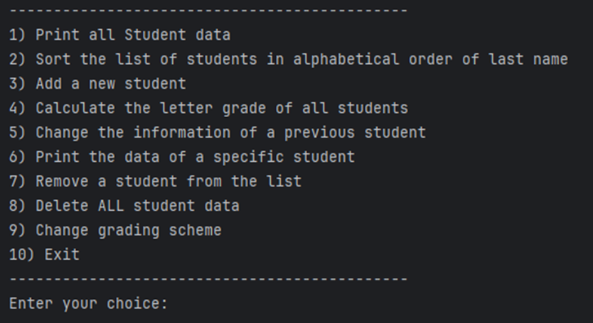
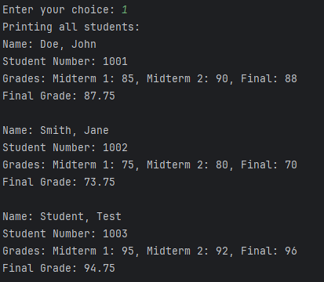
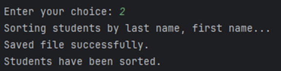
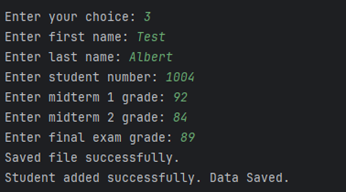
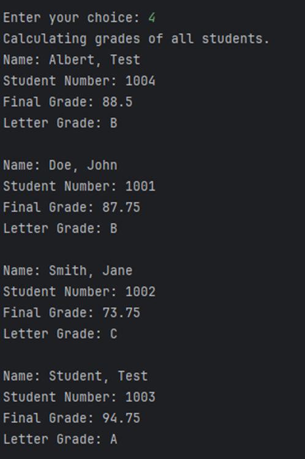
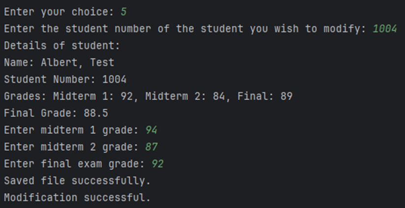
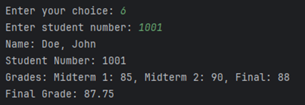
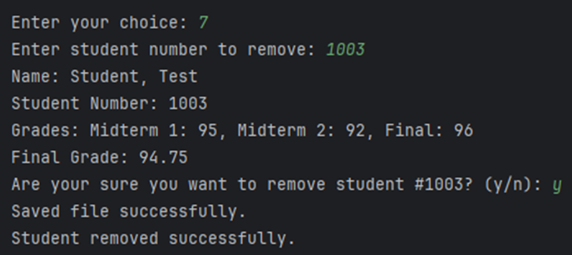
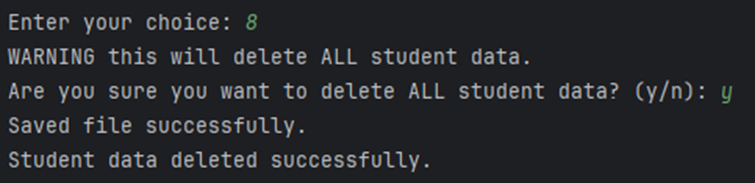
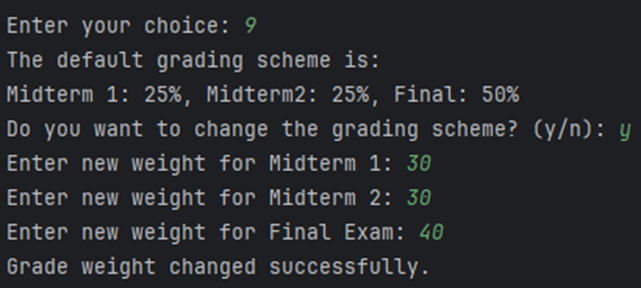

# Student Management System

## Overview
The Student Management System is a C++ program designed to manage student data. It allows users to perform various operations such as adding new students, modifying grades, calculating letter grades, and saving/loading data to and from a text file.

---

## Features
1. **Print All Students**: Display the list of all students in the system. Also displays their exam grades and final grade.
2. **Sort Students**: Sort the students alphabetically by last name, first name.
3. **Add New Student**: Add a new student to the system with grades.
4. **Calculate Letter Grades**: Calculate and display final grades and letter grades for all students.
5. **Change Student Information**: Modify the grades of an existing student.
6. **Print Specific Student**: Display details of a specific student by student number.
7. **Remove a Student**: Remove a student from the system using their student number.
8. **Delete All Student Data**: Delete all records from the system.
9. **Change Grading Scheme**: Update the weights for calculating final grades.

---

## **Installation**

1. Navigate to the project directory:
    ```bash
    cd project-directory
    ```
2. Compile the program:
    ```bash
    g++ -o student_management main.cpp Student.cpp StudentManager.cpp MenuHandler.cpp
    ```
3. Run the program:
    ```bash
    ./student_management
    ```

---

## **Usage**
When you run the program, you will be presented with a menu of options. Each option corresponds to a specific feature.


### **1. Print All Students**


---

### **2. Sort Students**


---

### **3. Add New Student**


---

### **4. Calculate Letter Grades**


---

### **5. Change Student Information**


---

### **6. Print Specific Student**


---

### **7. Remove a Student**


---

### **8. Delete All Student Data**


---

### **9. Change Grading Scheme**


---
## **Key Features**
- **Object-Oriented Design**: The program uses classes (`Student`, `StudentManager`, `MenuHandler`) to organize functionality logically.
- **Dynamic Memory Management**: Student data is managed dynamically to allow flexible modifications.
- **File I/O**: Supports saving and loading student data from files for persistence.
- **Error Handling**: Handles invalid inputs and prevents duplicate or missing entries.
